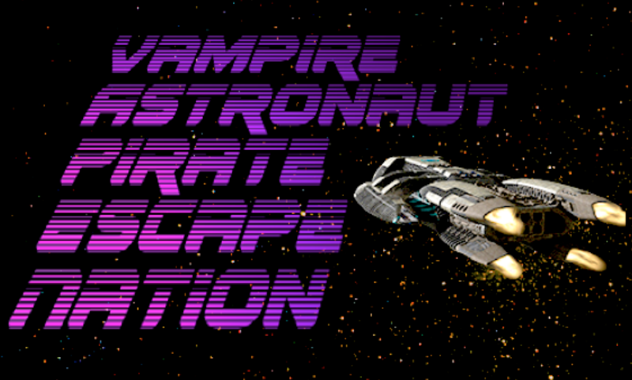

#  CPSC427 2019 Winter 1

# V.A.P.E. Nation (Vampire Astronaut Pirate Escape Nation)
## Team 6
- Andrea Park 45168151
- Andy (Dong Young) Kim 16785157
- Cody Newman 35833145
- Matteo Alps-Mocellin 32909146
- Sam Parhimchik 41037152
- Tanha Kabir 10850155

## Releases
- [Skeletal Game](https://github.students.cs.ubc.ca/CPSC427/vape_nation/releases/tag/skeletal-game)
- [Mimimal Playability](https://github.students.cs.ubc.ca/CPSC427/vape_nation/releases/tag/minimal-playability)
- [Playable Game](https://github.students.cs.ubc.ca/CPSC427/vape_nation/releases/tag/playable)

# Controls
- W, A, S, D  -> Movement
- WASD/Arrow keys -> Menu navigation
- Spacebar -> Shoot
- Enter ->  Vamp Mode / Skip Cutscenes / Menu Select
- Shift -> Continue (Dialogues)
- Escape -> Open/close pause menu
- [Debug] Shift+F to enter/exit debug mode
    - F -> Fill vamp mode
    - G -> Fill Health
    - V -> Invincibility
    - 1 -> At main menu only, go straight to level 1
    - 2 -> At main menu only, go straight to level 2
    - 3 -> At main menu only, go straight to level 3
    - Tab -> At main menu only, go straight to the BetweenLevelState between level 1 and 2
    - 0 -> At main menu only, go straight to outro

# Content
The game consists of the main menu a tutorial, intro, three levels, and an outro.

From the main menu, you can choose to continue a saved game (auto-saved at the start of each level / after you die. and cleared after beating the game), start a new game, play the tutorial, or exit the game.

Upon entering the tutorial, you will be walked through each of the controls and basic gameplay mechanics.

When you start a new game, you will be presented with an into cutscene before moving to the first level. Within a level, waves of enemies will spawn for 1-2 minutes before the boss is spawned.
If you die, the level will restart and you will lose a life. Once all lives are lost you are returned to the main menu. Once the boss is defeated, you will be move to the next level.

Once you complete the last level you are presented with an outro and credits, before being returned to the main menu.

# Music Credits:
- Main Menu:      
    - Dynatron - Stars of the Night
- Intro
    - Hubrid & BMX Escape - Pursuit Force
- Tutorial BGM:   
    - M.O.O.N - Dust
- Level 1 BGM:    
    - Dynatron - Pulse Power
- Level 1 Boss:   
    - Perturbator - Diabolus Ex Machina
- Victory: 
    - Final Fantasy VII - Victory Fanfare
- Level 2 BGM:
    - Vulta - Crepuscule
- Level 2 Boss:
    - Pertrubator - Versus
- Level 3 BGM:
    - ROBORG - HATED
- Level 3 Boss:
    - Perturbator - Disco Inferno
- Outro:
    - Magic Sword - Awakening

# Video Credits:
- Intro/Outro:
    - Space Pirate Captain Harlock (2013)

# Dependencies
- PhysFS is a dependency, which should be downloaded and built by cmake automatically when building.
## Windows
- All dependencies are included
## Mac / Linux
- GLFW3
- SDL2
- SDL_Mixer
- FFmpeg
## Assets
### Asset Packaging
The compiled executable expects a "assets.vapepak" asset package file adjacent to it, which it accesses using PhysFS.
As part of the build process, assets should be packaged automatically and placed in the runtime output directory.

Similarly to the Video Assets, if you need to repackage the assets (like if new assets are added to the game), 
you will need to delete the existing bin/assets.vapepak file and re-build.
You may need to add an empty line to cmakelists.txt to force it to build.

# Building a release
- Build on the target platform with cmake, using release build type `-DCMAKE_BUILD_TYPE=Release`
    - On Windows, If you build with MINGW the user will also need to have MINGW configured and in PATH to run the EXE. Recommend building the releases with the Visual Studio toolchain.
- The release should be packaged automatically into the `releases` folder